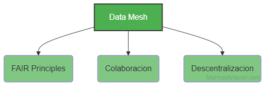
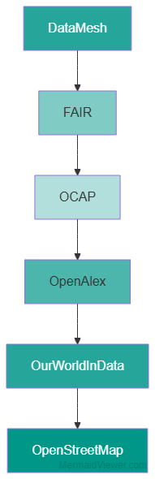
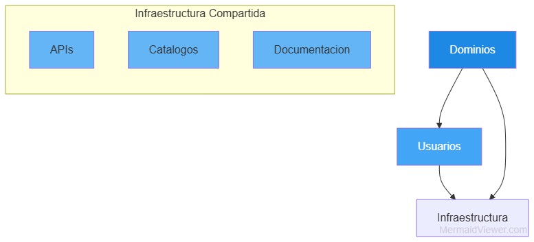
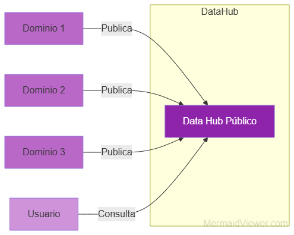
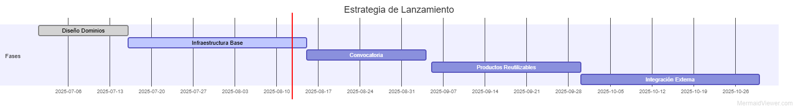
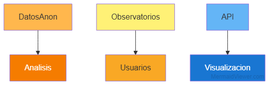
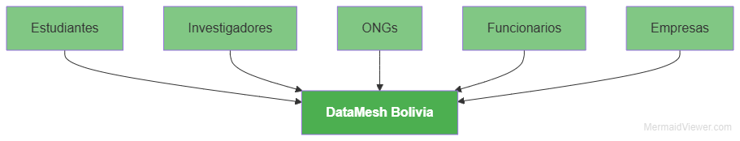

## 1. ¿Qué es Tejido de Datos Bolivia?

- Ecosistema nacional de datos **abierto, útil y distribuido**.  
- Inspirado en **Data Mesh**, **FAIR** y modelos globales como **OpenAlex**.  
- Objetivo: gobernanza colaborativa y descentralizada de datos para investigación e innovación social.  

---

## 2. ¿Por qué es necesario?

* Infraestructura actual **fragmentada y poco interoperable**.
* Falta acceso a datos **confiables y actualizados**.
* Necesidad de **soberanía local** y control comunitario sobre los datos.

---

## 3. Principios Clave

* **Descentralización:** dominios autónomos gestionan sus datos.
* **Interoperabilidad:** datos que se entienden y combinan fácilmente.
* **Reutilización:** datos disponibles para múltiples usos.
* **Simplicidad:** interfaces y procesos claros para todos.
* **Ciencia Abierta:** transparencia y ética en el acceso y uso.

---

## 4. Inspiraciones y Marcos

* **Data Mesh:** gobernanza federada y datos como productos.
* **FAIR:** datos localizables, accesibles y reutilizables.
* **OCAP:** apertura, colaboración y autonomía.
* Ejemplos globales: **OpenAlex, OurWorldInData, OpenStreetMap**.

---

## 5. Visión y Objetivos

* Crear una **red pública y descentralizada** de datos confiables.
* Promover **infraestructura compartida**: catálogos, APIs, documentación.
* Facilitar herramientas para **estadística e IA** con datos accesibles.
* Fomentar la gestión por **dominios autónomos**.

---

## 6. Arquitectura Esencial

* **Dominios:** grupos autónomos que producen y mantienen sus datos.
* **Data Hub Público:** conecta y facilita el acceso a los dominios.
* **Interoperabilidad:** protocolos, metadatos y validación compartida.

---

## 7. Infraestructura Común

| Componente         | Función                      |
| ------------------ | ---------------------------- |
| Catálogo Semántico | Búsqueda e indexación        |
| Repositorio GitHub | Código, ETL y documentación  |
| APIs RESTful       | Acceso programático estándar |
| Validadores        | Calidad y esquemas de datos  |
| Observabilidad     | Monitoreo y métricas         |

---

## 8. Estrategia de Lanzamiento

1. Definir y diseñar los **primeros dominios**.
2. Implementar la **infraestructura base**.
3. Convocar a **colaboradores** de distintos sectores.
4. Impulsar productos de datos **reutilizables y abiertos**.
5. Integrar con redes y repositorios **externos**.

---

## 9. Casos de Uso Iniciales

* Microdatos anonimizados para análisis estadísticos.
* Observatorios ciudadanos: precios, salud, transporte.
* API pública para análisis y visualización automática.

---

## 10. Conclusión y Llamado a la Acción

> “Descentralizar sin desordenar, abrir sin improvisar, innovar sin excluir.”

* Ética, sostenibilidad y colaboración para un país más informado.
* Invitamos a estudiantes, investigadores, ONGs, funcionarios y empresas a sumarse.

